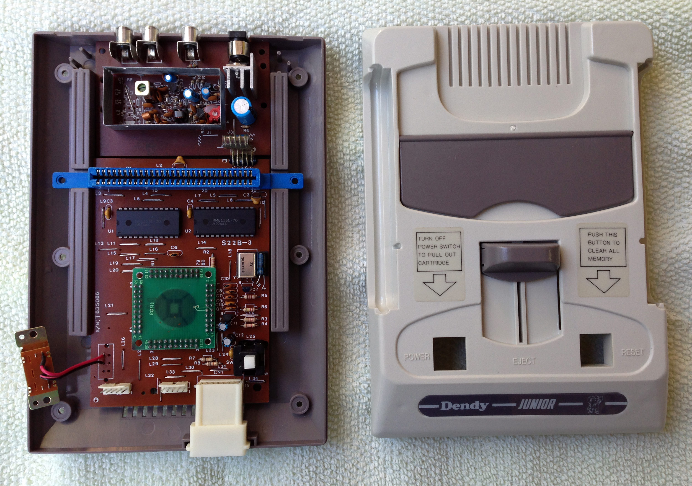
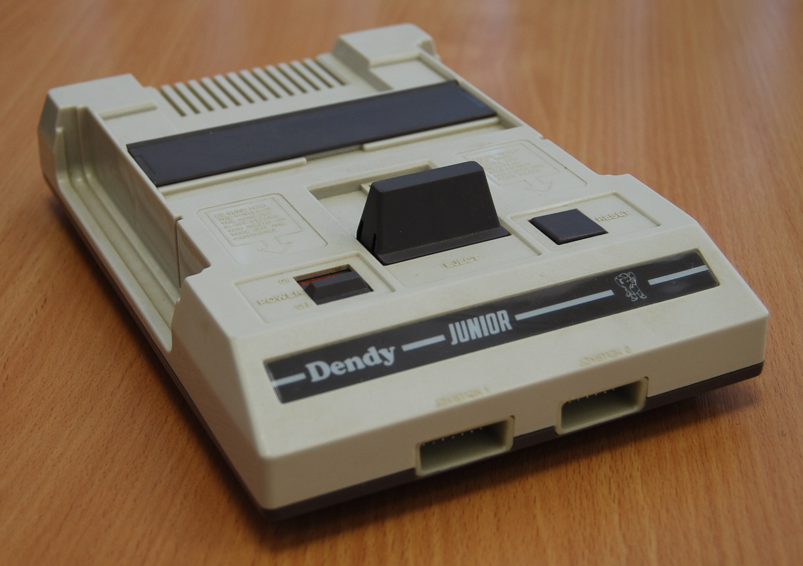

# Dendy Junior Remastered

## Печатные платы разных ревизий и под разные типы корпусов.

- dendy_junior_II - Корпус со встроенными "джойстиками"

- dendy_junior_MG-02 - Корпус у которого "джойстики" подключаются с переди

- dendy_junior_MG-02(Wide) - Корпус у которого "джойстики" подключаются с переди и расстояние меджу портами увеличенно.

- Разное расположение AV выходов.
